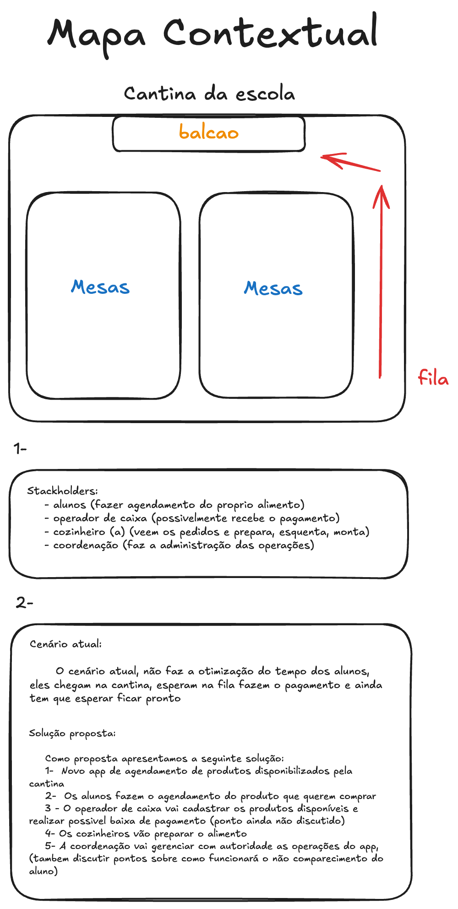

# Mapa Contextual – Cantina da Escola

## Descrição Geral

O mapa contextual representa o funcionamento atual da cantina de uma escola e apresenta uma proposta de melhoria baseada em um sistema de agendamento de pedidos.

No ambiente físico da cantina existe um **balcão de atendimento**, onde os pedidos são entregues, e uma **área com mesas**, destinada aos alunos que irão consumir os alimentos. Atualmente, os estudantes formam uma **fila** até o balcão para realizar o pedido, efetuar o pagamento e aguardar o preparo do alimento, gerando filas e aumentando o tempo de espera.

---

# Estrutura do Ambiente

- **Balcão:** local onde ocorre o atendimento, retirada dos pedidos e, possivelmente, o pagamento.
- **Mesas:** espaço onde os alunos permanecem para consumir os alimentos.
- **Fila:** formada ao lado do balcão, concentrando os alunos durante os horários de maior movimento.

---

# Stakeholders

## Alunos
- Realizam o agendamento do alimento pelo aplicativo.
- Retiram o pedido na cantina no horário definido.

## Operador de Caixa
- Cadastra os produtos disponíveis.
- Pode ser responsável pelo recebimento do pagamento (funcionalidade ainda em discussão).

## Cozinheiro(a)
- Visualiza os pedidos realizados.
- Prepara, aquece e monta os alimentos para entrega.

## Coordenação
- Gerencia a operação da cantina.
- Administra usuários, produtos e pedidos.
- Possui controle sobre as funcionalidades administrativas do sistema.

---

# Cenário Atual

Atualmente, o processo de compra apresenta alguns problemas:

1. O aluno precisa ir até a cantina.
2. Aguarda na fila para ser atendido.
3. Realiza o pagamento.
4. Aguarda o preparo do alimento.
5. Somente após o preparo recebe o pedido.

Esse fluxo gera filas, aumenta o tempo de espera e reduz a eficiência durante os horários de maior movimento.

---

# Solução Proposta

A proposta consiste no desenvolvimento de um **aplicativo de agendamento de pedidos**, permitindo que o aluno solicite seu alimento antes de chegar à cantina.

### Fluxo Proposto

1. A cantina disponibiliza os produtos no aplicativo.
2. O aluno realiza o agendamento do produto desejado.
3. O operador de caixa cadastra e atualiza os produtos disponíveis.
4. O pagamento poderá ser realizado pelo aplicativo ou presencialmente (definição pendente).
5. Os cozinheiros visualizam os pedidos antecipadamente e iniciam o preparo.
6. A coordenação gerencia toda a operação do sistema.

---

# Benefícios Esperados

- Redução das filas na cantina.
- Menor tempo de espera para os alunos.
- Melhor organização dos pedidos.
- Planejamento antecipado da produção dos alimentos.
- Maior eficiência operacional da equipe da cantina.
- Melhor experiência para os estudantes durante os intervalos.

---

# Pontos Ainda em Discussão

- Forma de pagamento (online ou presencial).
- Política para pedidos não retirados pelo aluno.
- Tempo máximo para retirada do pedido.
- Cancelamento e reagendamento de pedidos.
- Controle de disponibilidade e quantidade dos produtos.
```

